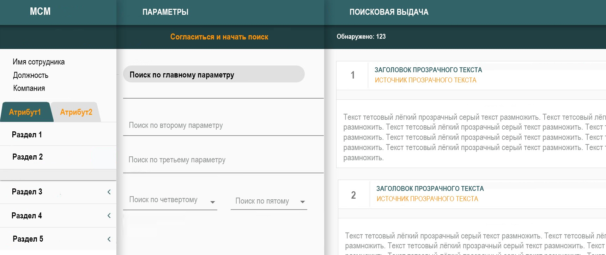
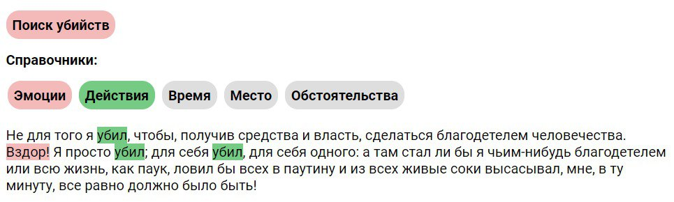
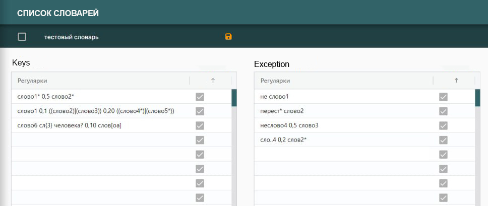
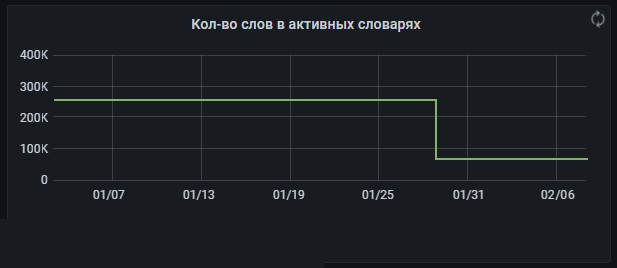
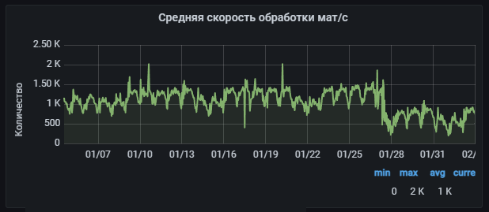

# Afterburner (utility - accelerator)
В проекте реализован функционал по оптимизации словарей регулярных выражений в программе МСМ (корпоративный проект компании).
МСМ ищет материалы по заранее подготовленному перечню источников (статьи сайтов, посты в соц сетях) на наличие в них заданных тем.



Поиск работает при помощи словарей, которые готовят лингвисты. Словари состоят из регулярных выражений regexp.
В МСМ реализована возможность добавлять запросы - слова и фразы, которые лингвисты называют ключами. Параллельно с ними используются исключения к запросам.



```
Пример.
Найти любое упоминание слова "разрешать", не используя отрицание перед этим словом.
Текст - "разрешать cookie или не разрешать"
Ключ - "разрешать"
Исключение - "не разрешать".
```


Спустя пару лет количество регулярных выражений в некоторых словарях стало критичным: в одном словаре могло храниться до 5 тысяч строк-ключей и до 50 тысяч исключений к этим ключам. 
Это сильно влияло на скорость обработки словарей и работу анализа.



Часто регулярки дублировали друг-друга и применить готовые методы удаления дубликатов автоматизированным способом было нельзя. 
Например, методы библиотеки Re - re.fullmatch, re.search - не позволяли выполнить эту задумку, т.к. речь касалась сравнения не двух обычных строк, а регулярных выражений.

## Решение
Утилита при запуске находит самые неэффективные словари- с минимальной точностью и максимальным количеством регулярных выражений.
Программа удаляет бесполезные и дублирующие строки, сохраняя обновлённый список строк в словарь в базе данных. 
После обработки всех словарей скорость анализа выросла в 1,7 раз. 
Среднее время сохранения словаря уменьшилась в 2,4 раза




Реализована возможность использовать утилиту для проверки двух регулярных выражений, аналогично методу re.fullmatch.
Реализована возможность при сохранении новых регулярных выражений в словарь - перед сохранением проверять на уникальность новые строки, удаляя неявные дубли. 
```
Пример.
В словаре содержится строка: "прыгнул (\S* ){0,10}скалы" 
Пользователь сохраняет: "прыгнул с отвесной скалы" - дублирует текущие строки, не сохранится в словарь
Пользователь сохраняет: ".*прыг.* (\S* ){0,10}ск.лы" - строка уникальна, сохранится в словарь.
```

## Уточнение
Синтаксис регулярных выражений в системе МСМ построен на основе библиотеки RegExp, однако для ускоренной записи лингвисты записывают в интерфейсе словарей упрощенную версию регулярок, после чего эти строки конвертируются в классические регулярки. Например: строка в словаре ```[а-я]+``` преобразуется при анализе материалов в вид ```^\S+$```. 
В этом проекте функционал построен на использовании синтаксиса регулярок МСМ. 

## Требования
* Python 3.9
* OS Windows, Linux
* pyenv → venv (см .python-version)

## Установка
Быстрая установка:
```
git clone https://github.com/ghiraphi/Afterburner.git
cd Afterburner
pip install pandas
pip install psycopg2
python main.py
```
